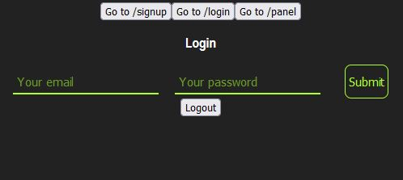
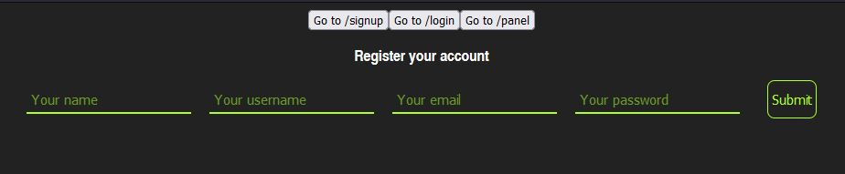
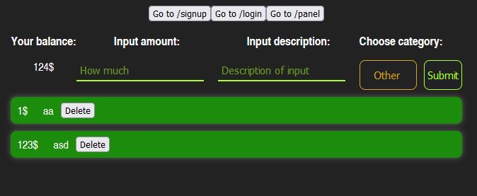

# Financial App 
> Live demo [_here_](http://152.70.182.129:8080/).

## Table of Contents
* [General Info](#general-information)
* [Technologies Used](#technologies-used)
* [Screenshots](#screenshots)
* [Setup](#setup)
* [Project Status](#project-status)
* [Room for Improvement](#room-for-improvement)
* [Contact](#contact)
<!-- * [License](#license) -->


## General Information
This is a web application which you can use it to manage money. This app has own login system based on JWT.


## Technologies Used
- Java, Spring Boot, Spring Security, Maven, Hibernate, MySQL, JavaScript, React, 


## Screenshots







## Setup
To clone and run this application, you'll need Git and Node.js (which comes with npm) installed on your computer. From your command line:
# Clone this repository

```
$ git clone https://github.com/PawelNagorzanski/financial-app.git

```
# Go into the repository
```
$ cd financial-app
```

# Install dependencies

```
$ npm install

```

# Run the app

```
$ npm start

```

After you clone this repository you have to add this code as constans.js inside the constans folder

```
export const API_BASE_URL = process.env.REACT_APP_API_BASE_URL || 'http://localhost:8080/api;
export const ACCESS_TOKEN = 'here is your acces token';
export const NAME_MIN_LENGTH = 4;
export const NAME_MAX_LENGTH = 40;

export const USERNAME_MIN_LENGTH = 3;
export const USERNAME_MAX_LENGTH = 15;

export const EMAIL_MAX_LENGTH = 40;

export const PASSWORD_MIN_LENGTH = 6;
export const PASSWORD_MAX_LENGTH = 20;'

Also here is application.properties for backend
'
spring.jpa.properties.hibernate.dialect=org.hibernate.dialect.MySQL5Dialect
spring.jpa.properties.hibernate.ddl-auto=update
spring.jpa.properties.hibernate.show-sql=true

spring.datasource.url=jdbc:mysql://localhost:3306/db?verifyServerCertificate=true&useSSL=false&serverTimezone=UTC&useLegacyDatetimeCode=false
spring.datasource.driverClassName: com.mysql.cj.jdbc.Driver
spring.datasource.username=springuser
spring.datasource.password=springuser123
spring.datasource.initialization-mode=always
spring.datasource.validationQuery=SELECT 1

logging.level.org.hibernate.SQL=DEBUG
app.jwtSecret=Your secret key
app.jwtExpirationInMs=Time
spring.server.port=8080
spring.server.compression.enabled=true

spring.jpa.database-platform=org.hibernate.dialect.H2Dialect


spring.jpa.hibernate.ddl-auto=update
spring.jpa.properties.hibernate.format_sql=true

spring.security.oauth2.client.registration.github.client-id=HERE IS YOUR ID FOR OAUTH
spring.security.oauth2.client.registration.github.client-secret=HERE IS YOUR ID FOR OAUTH

spring.security.oauth2.client.registration.google.client-id=HERE IS YOUR ID FOR OAUTH
spring.security.oauth2.client.registration.google.client-secret=HERE IS YOUR ID FOR OAUTH

spring.security.oauth2.client.registration.facebook.client-id=HERE IS YOUR ID FOR OAUTH
spring.security.oauth2.client.registration.facebook.client-secret=HERE IS YOUR ID FOR OAUTH

```


## Project Status
Project is in progress


## Room for Improvement
Here is my JIRA todo list [Jira](https://expense-app-pawel.atlassian.net/jira/software/projects/EXP/boards/1)


## Contact
Created by Paweł Nagórzański ( pnagorz@onet.pl ) - feel free to contact me!
